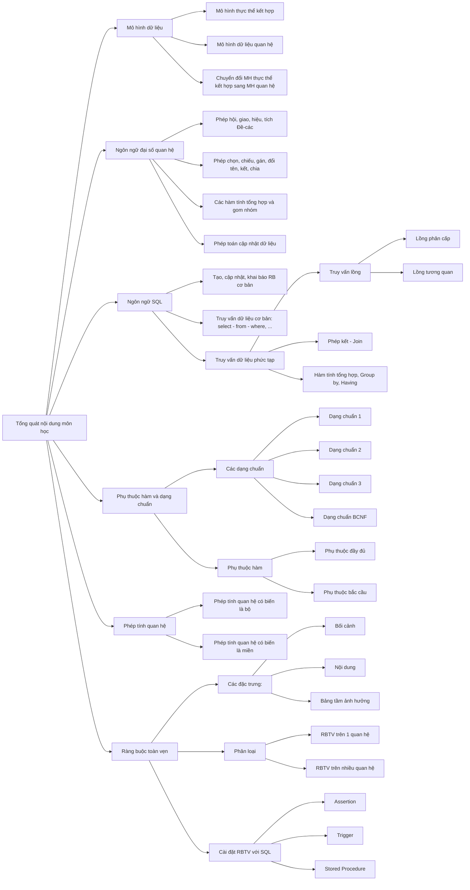
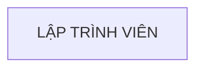
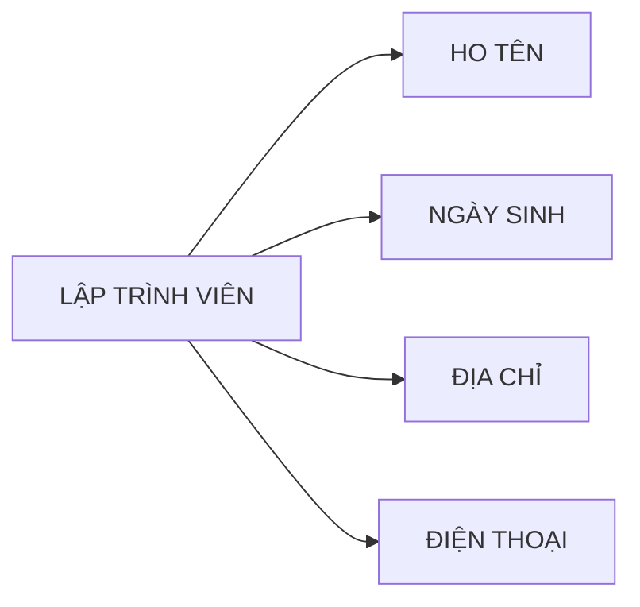
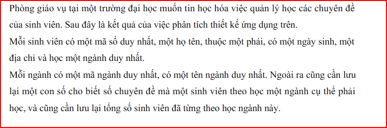
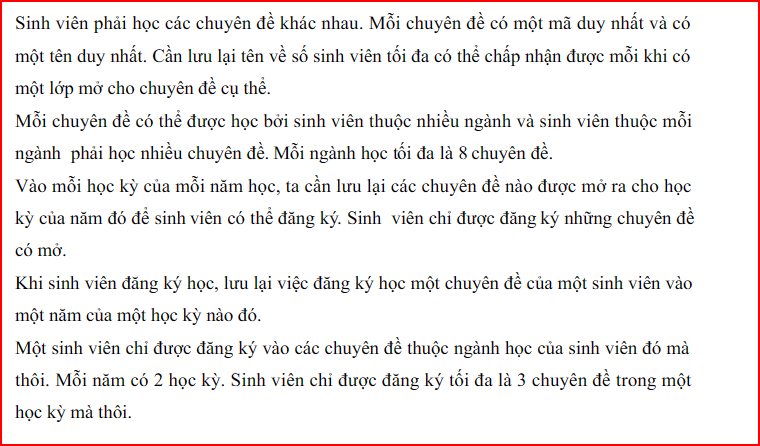
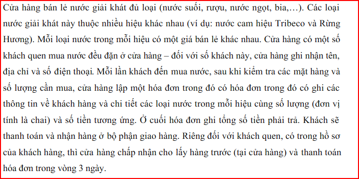
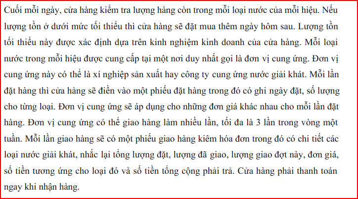
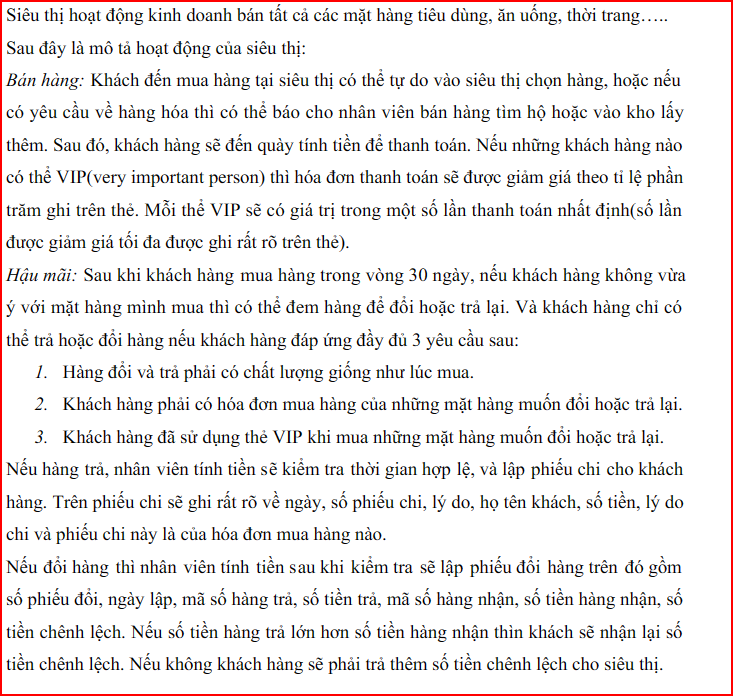
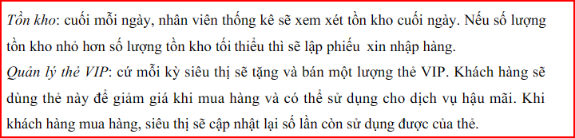

## Môn học: cơ sở dữ liệu



### Nội dung: </br>
I. [Mô hình thực thể kết hợp](#mô-hình-thực-thể-kết-hợp) </br>
II. [Mô hình dữ liệu quan hệ]() </br>
III. [Ngôn ngữ đại số quan hệ]() </br>
IV. [Ngôn ngữ SQL]() </br>
V. [Phụ thuộc hàm và dạng chuẩn]() </br>
VI. [Phép tính quan hệ]() </br>
VII. [Ràng buộc toàn vẹn]() </br>


# Mô hình thực thể kết hợp

## Nội dung:

- [Lý thuyết](#lý-thuyết)
- [Bài tập](#bài-tập)

## Lý thuyết

**1. Thực thể và tập thực thể:**

- Thực thể (entity) là một đối tượng ngoài thế giới thực, có thể cụ thể hoặc trừu tượng.
- Tập thực thể (set of entities) là tập hợp các thực thể có tính chất giống nhau.
- Kí hiệu của tập thực thể là 1 hình chữ nhật, bên trong có tên của tập thực thể.
- Ví dụ:
<div align="center">



tập thực thể lập trình viên

</div>

**2. Thuộc tính:**

- Thuộc tính là tập hợp các đặc trưng mô tả cho tập thực thể hay mối kết hợp.
- Kí hiệu của thuộc tính là 1 hình elip, bên trong có tên của thuộc tính.
- Thuộc tính gắn vào thực thể bằng một đường nối (cung vô hướng).
- Ví dụ:
<div align="center">



thuộc tính của tập thực thể lập trình viên (ignore the arrow :sweat_smile: )

</div>

- **Có nhiều loại thuộc tính :**
  - Thuộc tính đơn : không thể hay không cần chia thành nhiều thành phần nhỏ hơn
  - Thuộc tính đơn trị: chỉ nhận 1 giá trị đơn đối với mỗi thực thể.
    _Ví dụ:_ thuộc tính họ tên của giáo viên là thuộc tính đơn trị, mỗi giáo viên chỉ có 1 họ tên.
  - Thuộc tính đa trị: có thể nhận nhiều giá trị đối với mỗi thực thể.
    _Ví dụ:_ thuộc tính acc facebook của sinh viên là thuộc tính đa trị, mỗi sinh viên có thể có chục acc facebook :rofl:
  - Thuộc tính kết hợp: là thuộc tính được chia thành nhiều thành phần nhỏ hơn.
    _Ví dụ:_ thuộc tính địa chỉ của giáo viên là thuộc tính kết hợp, địa chỉ được chia thành 3 thành phần là số nhà, đường, quận, thành phố.
  - Thuộc tính suy diễn: là thuộc tính mà giá trị của nó được tính toán từ giá trị của các thuộc tính khác.
    _Ví dụ:_ thuộc tính tuổi của sinh viên là thuộc tính suy diễn, tuổi được tính toán từ ngày sinh của sinh viên.

**3. Mối kết hợp và tập mối kết hợp:**

- Mối kết hợp là sự liên kết giữa hai hay nhiều thực thể.
- Tập mối kết hợp là tập hợp các mối kết hợp tương tự nhau.
- Kí hiệu của tập mối kết hợp là hình thoi, bên trong có đặt tên của tập mối kết hợp đó.

- **Tập mối kết hợp được chia thành 4 loại chính:**
  - Tập mối kết hợp 1-1: mỗi thực thể trong tập thực thể A kết hợp với 1 thực thể trong tập thực thể B.
  - Tập mối kết hợp 1-n: mỗi thực thể trong tập thực thể A kết hợp với 1 số thực thể trong tập thực thể B. Tuy nhiên 1 thực thể trong B chỉ kết hợp với 1 thực thể trong A.
  - Tập mối kết hợp n-1: mỗi thực thể trong tập thực thể A kết hợp với một thực thể trong tập thực thể B. Tuy nhiên 1 thực thể trong B kết hợp với 1 số thực thể trong tập thực thể trong A.
  - Tập mối kết hợp n-n: mỗi thực thể trong tập thực thể A có thể kết hợp nhiều thực thể trong tập thực thể B và ngược lại.

**4. Bản số:**

- Bản số được xác được bởi một cặp chỉ số (min, max) :
  - min: số lượng tối thiểu các thực thể thuộc thuộc tập thực thể E tham gia vào tập mối kết hợp R.
  - max: số lượng tối đa các thực thể thuộc thuộc tập thực thể E tham gia vào tập mối kết hợp R.

**5. Thuộc tính trên tập mối kết hợp:**

- Thuộc tính trên tập mối kết hợp tương tự như thuộc tính trên thực thể, chỉ khác ở chỗ nó được gắn vào tập mối kết hợp.

**6. Tên vai trò:**

- Tên vai trò của tập mối kết hợp dùng để biểu diễn ngữ nghĩa của mối kết hợp đó.

**7. Khóa của tập thực thể:**

- Khóa là một tập ít nhất các thuộc tính giúp ta xác định duy nhất một thực thể trong tập thực thể đó.
- Khóa cũng giúp ta xác định mối kết hợp là duy nhất trong tập mối kết hợp.
- Các thuộc tính khóa được ký hiệu bằng cách gạch chân dưới tên của thuộc tính.

## Bài tập:

**1. Hãy xây dựng mô hình ER cho hệ thống quản lý bán hàng được mô tả như sau:**
Một cửa hàng chuyên bán sỉ và lẻ các mặt hàng đủ loại. Người quản lý cửa hàng cần xây dựng một ứng dụng quản lý công việc đặt hàng, giao hàng và bán hàng tại cửa hàng. Sau đây là kết quả của việc phân tích yêu cầu ứng dụng:
- Cửa hàng bán ra trên 300 mặt hàng với nguồn hàng lấy ra từ các nguồn cung cấp. Một nhà cung cấp có một mã nhà cung cấp, tên, địa chỉ và số điện thoại của nhà cung cấp. Mỗi nhà cung cấp có thể cung ứng nhiều mặt hàng khác nhau và mỗi mặt hàng cũng có thể được cung ứng bởi nhiều nhà cung cấp khác nhau, cần ghi lại nhận lại nhà cung cấp nào có thể cung ứng mặt hàng nào. 
- Cần lưu lại thông tin về tất cả các mặt hàng mà cửa hàng có mua bán: mã mặt hàng, tên hàng, hàng thuộc loại nào , đơn vị tính, qui cách, số lượng tồn. Mỗi loại hàng có mã loại hàng, tên loại hàng.
- Mỗi lần đặt hàng, cửa hàng sẽ đặt 1 phiếu đặt hàng gửi đến nhà cung cấp. Cửa hàng phải điền các thông tin sau vào đơn đặt hàng: số đơn đặt hàng, ngày đặt hàng, đặt tại nhà cung cấp nào, số lượng cần đặt đối với từng mặt hàng là bao nhiêu. Cuối mỗi đơn đặt hàng có thông tin về tổng số mặt hàng cần đặt. Trên phiếu đặt hàng chỉ có các mặt hàng mà nhà cung cấp đó có cung ứng.
- Mỗi khi đến giao hàng, nhà cung cấp giao cho cửa hàng 1 phiếu giao hàng, gồm các thông tin sau: số phiếu giao, ngày giao, giao cho đơn đặt hàng nào, mỗi mặt hàng số lượng giao và đơn giá là bao nhiêu. Ứng với một lần đặt hàng, nhà cung cấp có thể giao hàng tối đa 3 lần và không được trễ hơn 7 ngày so với ngày đặt. Nhà cung cấp chỉ được giao các mặt hàng mà cửa hàng đã đặt với số lượng giao không vượt quá số lượng đặt.
- Khi khách hàng đến mua hàng, cửa hàng sẽ lưu lại tất cả thông tin các hóa đơn bán hàng để tiện việc kiểm tra. Thông tin hóa đơn gồm: số hóa đơn, ngày lập hóa đơn, tên khách hàng, địa chỉ khách hàng, điện thoại khách hàng, khách hàng đã mua những mặt hàng nào với số lượng mua, đơn giá mua là bao nhiêu.


**_Solution:_**

**2. Sau đây là mô tả về hệ thống Quản lý tồn kho. Hãy xây dựng mô hình ER cho hệ thống này:**

- Kho hàng là nơi quản lý các mặt hàng của công ty. Mỗi kho hàng có một mã số duy nhất (MÃ_KHO) dùng để phân biệt các kho hàng khác, một tên hàng và một loại hàng mà kho đó chứa. Mỗi kho có một địa điểm nhất định được xác định bởi mã số địa điểmm (MÃ_DD), địa chỉ địa điểm, có một nhân viên phụ trách địa điểm và số điện thoại để liên lạc với kho tại địa điểm trên. Một kho chỉ chứa một loại hàng, một địa điểm có thể có nhiều kho. Một mặt hàng có một mã số duy nhất (MÃ_MH) để phân  biệt các mặt hàng khác, có một tên hàng. Một mặt hang được xếp vào một loại hàng, và một loại hàng có nhiều mặt hàng. Mỗi loại hàng có một mã số duy nhất để phân biệt (MÃ_LH), và có một tên loại hàng. Một mặt hàng có thể chứa ở nhiều kho, một kho có thể chứa nhiều mặt hàng cùng loại. Số lượng tồn kho của mỗi mặt hàng được xác định bởi phiếu nhập và phiếu xuất hàng. Mỗi phiếu nhập hàng có số phiếu nhập (SỐ_PN) duy nhất để phân biệt, và có ngày lập phiếu, phiếu nhập cho biết nhập tại kho nào, có chữ kí của nhân viên phụ trách địa điểm của kho đó. Trong chi tiết của phiếu nhập cho biết số lượng nhâp của các mặt hàng của một phiếu nhập. Mỗi phiếu xuất hàng có số phiếu xuất (SỐ_PX) duy nhất để phân biệt, và có ngày lập  phiếu, phiếu xuất cho biết xuất tại kho nào, chữ lý của nhân viên đi nhận hàng tại kho đó.. Trong chi tiết của phiếu xuất cho biết số lượng xuất của các mặt hàng của một phiếu xuất. 
Thông tin của nhân viên phụ trách địa điểm tại các kho và nhân viên đi nhận hàng từ các kho bao gồm: Mã nhân viên (MÃ_NV) để phân biệt giữa các nhân viên, có họ tên, phái, năm sinh, địa chỉ thưởng trú, số điện thoại của nhân viên


**_Solution:_**

**3. Hãy xây dựng mô hình ER cho Hệ thống quản lý chuyên đề được mô tả như sau:**
<div align="center">


</div>

**_Solution:_**

**4. Hãy xây dựng mô hình ER cho Hệ thống quản lý cửa hàng nước giải khát được mô tả như sau:**
<div align="center">


</div>

**_Solution:_**

**5. Sau đây là mô tả về việc quản lý bán hàng tại một siêu thị. Hãy xây dựng mô hình ER cho hệ thống này:**
<div align="center">


</div>

**_Solution:_**

**6: Thiết kế ER. Chuyển qua lược đồ quan hệ**
```
Siêu thị có nhiều loại hàng hóa. Mỗi loại hàng gồm mã duy nhất, tên loại hàng. Mỗi loại hàng
có nhiều hàng hóa. Hàng hóa bao gồm mã hàng hóa, tên hàng hóa, lượng tồn, giá hiện thời.
Trong đó mã hàng hóa chỉ phân biệt trong cùng 1 loại hàng.
Thông tin mua hàng của khách hàng sẽ lưu trong hóa đơn. Hóa đơn gồm có tên khách hàng,
ngày mua, tổng tiền, danh sách các mặt hàng cùng với số lượng, đơn giá của chúng. Ngoài ra,
các hóa đơn của cùng 1 khách hàng sẽ được phân biệt thông qua mã hóa đơn.
Cần lưu thông tin khách hàng như sau mã khách hàng duy nhất, tên khách hàng, đia chỉ (số
nhà, đường, phường, quận, thành phố). Nếu khách hàng yêu cầu thì nhân viên siêu thi sẽ
giao hàng. Khi giao hàng cần ghi nhận sản phẩm nào đã được giao, thời gian giao và nhân viên
nào giao. Nếu hóa đơn có nhiều hàng thì cho phép giao nhiều lần.
Nhân viên siêu thị có mã nhân viên duy nhất phân biệt các nhân viên khác, họ tên nhân viên,
nhân viên có nhiều số điện thoại, có thể có nhiều chứng chỉ nghiệp vụ.
```

**_Solution:_**

**7: Thiết kế ER. Chuyển qua lược đồ quan hệ**
```
Có nhiều đội thi, mỗi đội thi có IDDoi là duy nhất để phân biệt các đội khác, có tên đội không
trùng với các đội khác, gồm 1 đội trưởng là 1 thành viên trong đội. Mỗi đội thi có nhiều thành
viên, mỗi thành viên có ID thành viên phân biệt với các thành viên khác trong đội, có họ tên,
ngày sinh, giới tính (Nam hoặc nữ) . Trường tổ chức nhiều trận đấu giữa các đội. Mỗi trận đấu
có ID trận đấu duy nhất, ngày thi đấu, đội chiến thắng trong trận đấu. Một trận đấu có nhiều
đội tham gia thi đấu, mỗi đội có thể tham gia nhiều trận đấu, mỗi đội khi tham gia trận đấu
sẽ có điểm số tương ứng (điểm số từ 1 đến 100). Trong một trận đấu, đội có tham gia sẽ có
xác nhận tham gia (C: có tham gia, V: vắng thi)
``` 

**_Solution:_**

**8: Thiết kế ER & chuyển qua lược đồ quan hệ**
```
Trường có nhiều khoa, mỗi khoa gồm mã khoa để phân biệt các khoa, tên khoa, năm thành
lập, do 1 giảng viên trong khoa làm trưởng khoa. Mỗi giảng viên có mã giảng viên là duy nhất
phân biệt các giảng viên, họ tên, số cmnd là duy nhất, ngày sinh, làm việc tại 1 khoa, học vị
hiện tại của giảng viên. Biết thông tin học vị gồm mã học vị là duy nhất, phân biệt các học vị
khác, tên học vị là duy nhất.
Mỗi khoa thành lập nhiều nhóm nghiên cứu. Thông tin nhóm gồm mã nhóm là duy nhất để
phân biệt các nhóm, tên nhóm, ngày lập nhóm, do 1 giảng viên trong khoa làm trưởng nhóm,
và thuộc một khoa trong trường.
Mỗi nhóm nghiên cứu có thể có nhiều thành viên tham gia. Cần ghi nhận thông tin các thành
viên của nhóm: mã giảng viên, ngày vào nhóm, ngày rời nhóm. Mỗi thành viên cũng có thể
tham gia vào các nhóm nghiên cứu khác nhau.

Trong quá trình làm việc tại khoa, cần ghi nhận lại quá trình thay đổi học vị của giảng viên,
gồm mã giảng viên, mã học vị, ngày cấp, nơi cấp. Mỗi giảng viên có thể có nhiều học vị, mỗi
học vị có nhiều giảng viên đạt được. Ví dụ 1 giảng viên là thạc sỹ, sau đó học lên và đạt tiến
sĩ.
```

**_Solution:_**


_will be updated when I have free time..._ 😅

<!-- 

### Tài liệu tham khảo:
- [Ngôn ngữ đại số quan hệ](https://voer.edu.vn/m/cac-phep-toan-dai-so-quan-he/6cd3b4c6)


_to be continued..._


mermaid 
flowchart TD
    A[Christmas] ->|Get money| B(Go shopping)
    B -> C{Let me think}
    C ->|One| D[fa:fa-laptop Laptop]
    C ->|Two| E[fa:fa-phone iPhone]
    C ->|Three| F[fa:fa-car Car]


mermaid
erDiagram

  demo-customers {
    INT id
    VARCHAR name
    VARCHAR email
  }

  demo-orders {
    INT id
    INT customer_id
    DATE order_date
    DECIMAL total_amount
  }

  demo-customers ||--o{ demo-orders : "foreign key"

 -->


